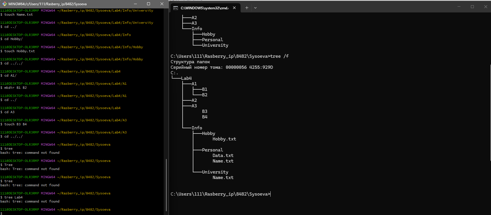

# Лабораторная работа №2

## Структура файловой системы

### Описание задания

Необходимо создать иерархическую структуру каталогов согласно представленной схеме. Корневым каталогом является **Lab2 Вариант-4**, который содержит подкаталоги первого уровня и их вложенные структуры.

### Схема структуры директорий

```
                          Lab4
            ┌─────────────┼─────────────┐
            │             │             │
           Info           A2            A1            A3
        ┌───┼───┐                    ┌───┴───┐      ┌───┴───┐
     Personal University Hobby       B1      B2     B3      B4
```

**Уровни вложенности:**
- **Уровень 1:** Lab4 (корневая директория)
- **Уровень 2:** Info, A2, A1, A3
- **Уровень 3:** 
  - Info → Personal, University, Hobby
  - A1 → B1, B2
  - A3 → B3, B4

---

## Результат выполнения

### Скриншот выполнения команды tree


